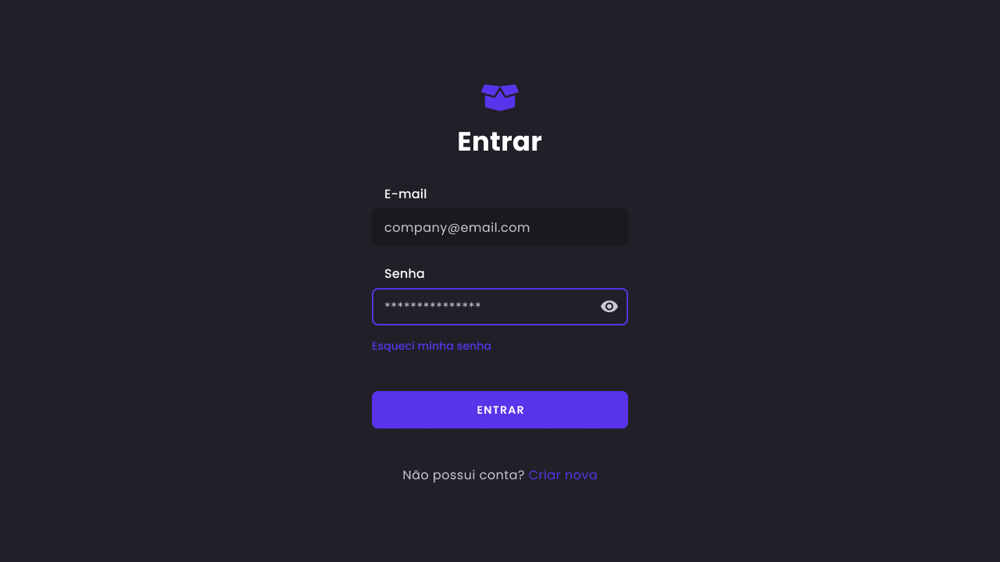
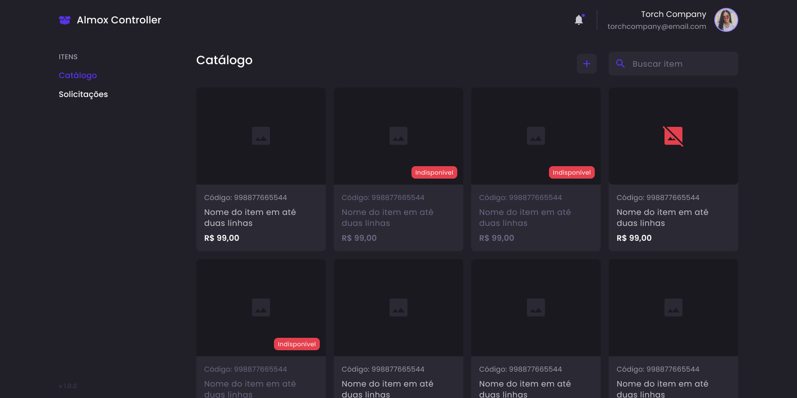
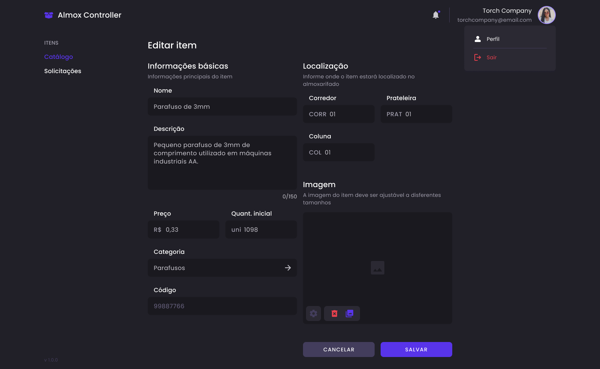
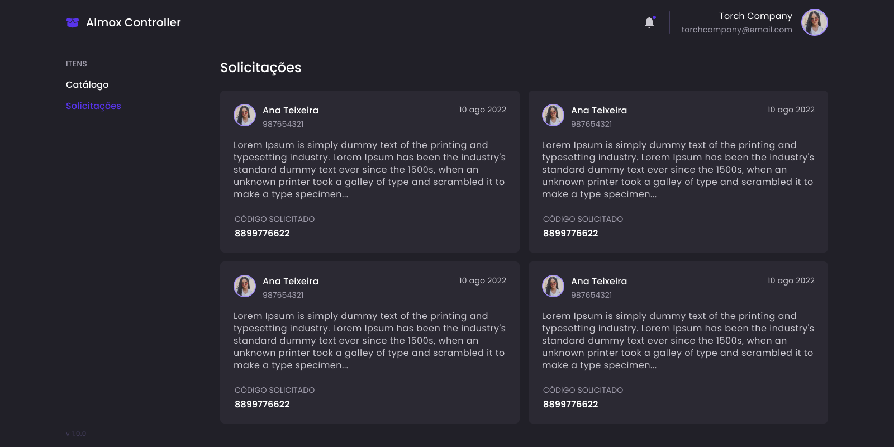

# Almox Controller

Esse é um projeto baseado em uma aplicação real desenvolvida para uma grande empresa cervejeira do Brasil, com o objetivo de controlar o almoxarifado da mesma.

Essa versão da aplicação conta com diversas melhorias (design, funcionalidades e etc.) que não foram possíveis serem adicionadas ao projeto original devido as suas especificações e seus detalhes de implementação que dependiam de um sistema utilizado internamente pela empresa.

## Status

Esta plataforma é um projeto pessoal, baseado em uma aplicação real desenvolvida por **[**mim**]([jonasGN (Jonas Gonçalves) · GitHub](https://github.com/jonasGN))** (front-end) e por [**Matheus Faria**]([quantux (Matheus Faria) · GitHub](https://github.com/quantux)) (back-end). 

Contudo, essa versão é apenas voltada para material de estudo e de testes com o objetivo de melhorar minhas habilidades pessoais, tendo toda a aplicação desenvolvida por mim (**design das telas**, **web**, **mobile** e **back-end**). 

Dessa forma, seu desenvolvimento é feito durante o tempo livre que tenho para dedicar ao projeto.

A aplicação se encontra com os seguintes status para cada escopo:

- **Web**: aplicação web do painel administrativo [**código em andamento**]

- **Mobile**: aplicação para dispositivos móveis [**design completo**]

- **Back-end**: back-end da aplicação para servir a web e mobile [**pendente**]  

---

## Preview

## Dependências

Antes de executar o projeto, é necessário instalar as dependências do mesmo em seu ambiente de trabalho. 

### Web

A aplicação web fora desenvolvida em ReactJS, portanto, é necessário realizar a instalação das seguintes dependências:

- [Node]([Download | Node.js](https://nodejs.org/en/download/))

- [Yarn](https://yarnpkg.com/getting-started/install)

### Back-end

Sem dependências devido à seu estágio de desenvolvimento. 

### Mobile

Sem dependências devido à seu estágio de desenvolvimento.

---

## Como utilizar

Esse é um Monorepo contendo a aplicação **web**, o **back-end** e também o **mobile** da plataforma, por esse motivo as especificidades de cada um fora separado e alocado em suas respectivas documentações, que podem ser acessadas através dos links abaixo:

- [Web](./frontend/README.md)

- [Mobile](./backend/README.md)

- [Back-end](./mobile/README.md)
  
  

---

## Melhorias a serem feitas

Durante o desenvolvimento dessa plataforma, fora observado a possibilidade de realizar algumas melhorias no projeto em geral. São elas:

- [ ] Adicionar prefixos automáticos aos commits de acordo com o contexto do projeto (web, back-end e mobile);
- [ ] Criar um container contendo todas as dependências do projeto;
- [ ] Traduzir documentação para o inglês;
- [ ] Não permitir importações em determinadas pastas do projeto (web) 
